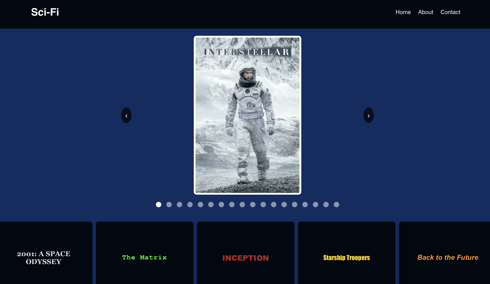

# Sci-Fi Movie Landing Page

## Overview

This project is a responsive landing page that dynamically fetches and displays data about sci-fi movies using the TMDb (The Movie Database) API. The page features a carousel of movie posters, a dropdown for selecting different movies, and sections for movie trailers and detailed information.

## Features

- **Responsive Design**: Fully responsive and works well on both desktop and mobile devices.
- **Movie Carousel**: Displays a carousel of movie posters with navigation controls.
- **Movie Details**: Shows detailed information about selected movies.
- **Movie Trailers**: Provides links to trailers for selected movies.
- **Dropdown Selection**: Allows users to select a movie and view its details and trailers.
- **Error Handling**: Displays error messages if data fetching fails.

## Technologies Used

- **Front-End**: React.js
- **API Integration**: TMDb API
- **Styling**: CSS
- **Development Tools**: Create React App

## Setup

### Prerequisites

- Node.js and npm installed on your machine.

