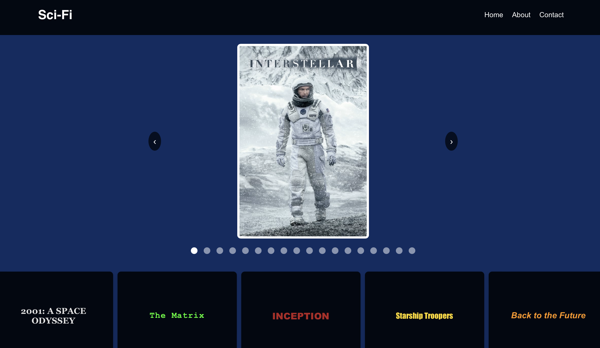

# 🪐 Sci-Fi Movie Landing Page
## 🔗 Live Demo

- **Production (Vercel)**: [Live Demo](https://interstellar-landing-git-master-odinsbeard82s-projects.vercel.app/)
- **Backend API (Render)**: [API Endpoint](https://interstellar-landing.onrender.com)

📖 Overview

This project is a full-stack responsive movie landing page that dynamically fetches and displays trending sci-fi movies using the TMDb (The Movie Database) API via a custom FastAPI backend.

The application features a modern React frontend deployed on Vercel and a FastAPI backend deployed on Render.

✨ Features

Responsive Design – Works seamlessly on desktop and mobile

Live Movie Data – Fetched from a FastAPI backend

Trending Movies Endpoint

Dynamic Rendering – React state updates from API responses

CORS Configured for Production

Full Deployment Pipeline (GitHub → Vercel + Render)

🛠 Technologies Used
Frontend

React

Vite

CSS

Backend

FastAPI

Python

TMDb API integration

Deployment

Vercel (Frontend)

Render (Backend)

GitHub (Version Control)

⚙ Setup (Development)
Prerequisites

Node.js

Python 3.9+

npm

Frontend
cd frontend
npm install
npm run dev
Backend
cd backend
pip install -r requirements.txt
uvicorn app.main:app --reload
📌 Notes

This project demonstrates:

Full-stack development

Cross-origin API communication

Production deployment and debugging

Real-world CORS configuration

Version control and CI deployment flow

